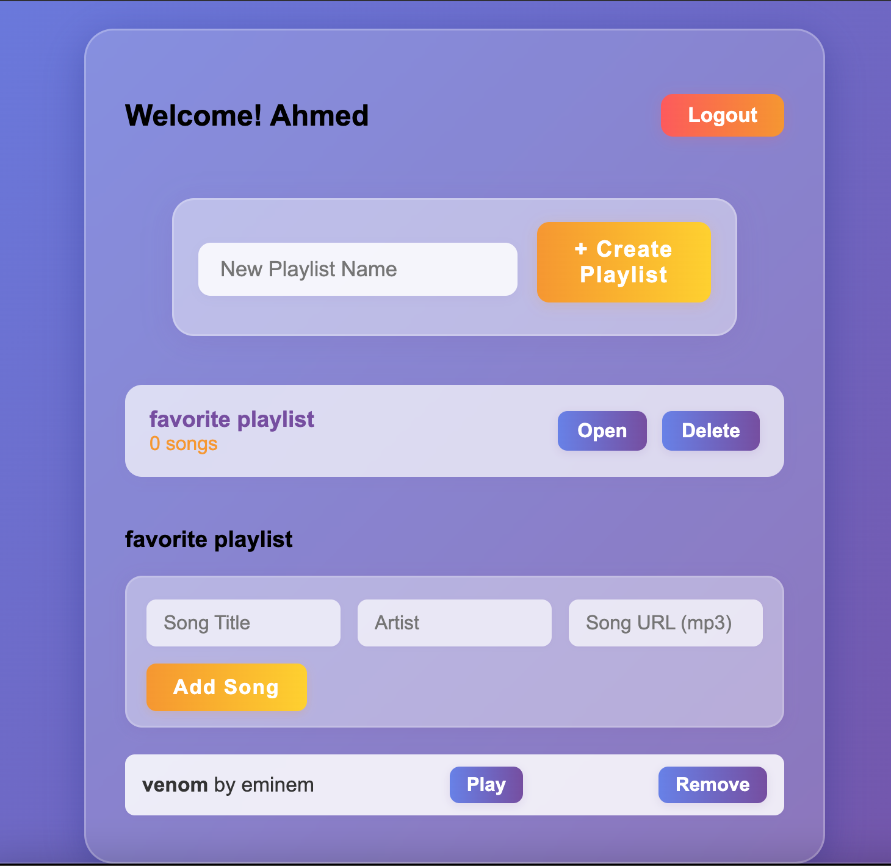

# demo

# Music Playlist App

A modern, local music playlist web app with user login, playlist management, and audio playback. All data is stored in your browser (no backend required).

## Features

- Local signup and login (username/email, password, and display name)
- Each user has their own playlists and songs
- Create, open, and delete playlists
- Add, play, and remove songs (title, artist, URL)
- Responsive, beautiful UI with modern styling
- Audio playback for song URLs (mp3)
- Secure user separation (each user sees only their data)
- Logout support

## How to Use

1. **Open `index.html` in your browser.**
2. **Sign Up:**
   - Enter your name, a username/email, and a password.
   - Click "Sign Up". You will be redirected to your playlist page.
3. **Login:**
   - Enter your name (for greeting), your username/email, and password.
   - Click "Login". You will be redirected to your playlist page.
4. **Create Playlists:**
   - Click "+ Create Playlist" and enter a playlist name.
5. **Add Songs:**
   - Open a playlist, fill in song title, artist, and a direct mp3 URL, then click "Add Song".
   - Each song can be played or removed.
6. **Delete Playlists:**
   - Click "Delete" on any playlist to remove it.
7. **Logout:**
   - Click the "Logout" button to return to the login page.

## Data Storage

- All user data is stored in your browser's `localStorage`.
- No data is sent to any server.

## Notes

- For demo/testing, you can use any direct mp3 URL for song playback.
- Passwords are stored in plain text (for demo only; do not use real credentials).
- To reset all data, clear your browser's localStorage for this site.

---

**Enjoy your music playlists!**
